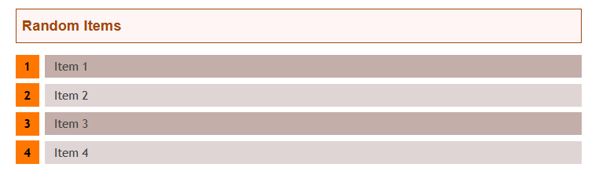
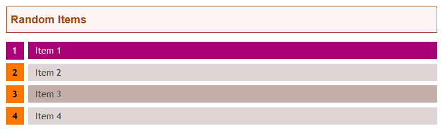

# Roll +Style

> HTML ordered list into rolling tables

This script is about turning a simple ordered list, like this : 

```
<ol>
  <li>My item 1</li>
  <li>My item 2</li>
  <li>My item 3</li>
  <li>My item 4</li>
</ol>
```

into a prettier table, that is rollable. It is suited for website about TTRPGs, to display random tables.



Extra bonus, when you click on the header of the table, a random element is selected :



## How to achieve that?

First, add the `css/roll-style.css` to your page, as a standard CSS file.

```
<link rel="stylesheet" type="text/css" href="./css/roll-style.css" media="screen">
```

Then, at the end of your HTML page, add the script from `js/roll-style.js` : 

```
<script src="js/roll-style.js"></script>
```

No dependency is required. The last thing to do is to add an ordered list to your html code. As you may want to still display standard ordered list into your page, not all `ol` elements are transformed. In order to transform it, the `ol` must be preceded by a `div` with the class `random-table-header`.

My own usage (generating from markdown) of this code doesn't allow me to alter the ordered list (add a class, for example), so I went with this solution. It allows me to put a header, and to make it clickable.

```
<div class="random-table-header">Random Items</div>

<ol>
  <li>My item 1</li>
  <li>My item 2</li>
  <li>My item 3</li>
  <li>My item 4</li>
</ol>
```

## License and usage

The code is under MIT license. Do what you want with it. If you want to provide new style for the list, to enhance the code, feel free and push me some code !

If you use it and want to reference me : https://www.gulix.fr

For the style, I used the example at : https://catalin.red/css3-ordered-list-styles/ 


